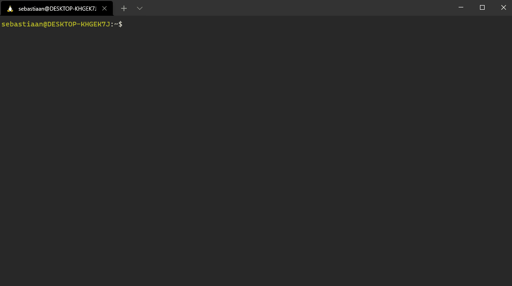

# k8s-workstation

I started this project to be able to easily switch between different operating systems while maintaining a consistent environment for working with Linux, Kubernetes and programming languages. The Docker image uses an Ubuntu base image in which zsh and vim plugins are configured and installed. In addition, some scripts are added to download various CLI tools.



## Getting Started

* build the container
```bash
docker build . -t k8s-workstation
```

* create directory that is used as local volume
```bash
mkdir ~/k8s-workstation
```

* to run the container
```bash
 docker run \
    -v ~/k8s-workstation:/home/dev \
    -v $godir:/home/$username/go \
    -e ZSH_THEME=$theme \
    -p 8080-8085:8080-8085 \
    -p 8250:8250 \
    -ti k8s-workstation
```

* install startup script in /usr/local/bin for easy access. 
```bash
#!/bin/bash

image="k8s-workstation"
homedir="$HOME/k8s-workstation"
theme="gruvbox"

if [ ! -d "$homedir" ] ; then echo "dir doesn't exist: $homedir" ; exit 1 ; fi

# Find running containers
ps="$(docker ps | grep "$image" | grep -v "CONTAINER")"

# If multiple containers are running, exit
if [ "$( wc -l <<< "$ps")" -gt 1 ]; then
  echo "Multiple $image containers running:"
  echo "$ps" && exit 1
# If only one container is running, exec
elif [ -n "$ps" ] && [ "$( wc -l <<< "$ps")" -eq 1 ] ; then
  echo "Exec into container $(awk '{print $1 " " $2}' <<< $ps)"
  docker exec -ti "$(awk '{print $1}' <<< $ps)" /bin/zsh
# No containers running, start new one
else
  echo "Starting new k8s-workstation container ..."
  ## Run container and expose ports 8080-8085 (for exposing services) and port 8250 (vault) 
  docker run \
     -v $homedir:/home/dev \
     -e ZSH_THEME=$theme \
     -p 8080-8085:8080-8085 \
     -p 8250:8250 \
     -ti $image
fi
```

### Exposing services from container

#### Windows WSL2

Make sure to run the container with --publish (-p) and a set of ports.
Also make sure the service uses listen address 0.0.0.0

* kubectl example:
`kubectl port-forward pods/podinfo-7cd6c96d57-ctlpn 8080:8080 --address 0.0.0.0`

* vault example:
`vault login -method=oidc listenaddress=0.0.0.0`

### vim Autocompletion
#### Golang
* open vim and run `:GoInstallBinaries` to install binaries in $GOPATH (/home/k8s/go).

### Python
* pip install jedi
